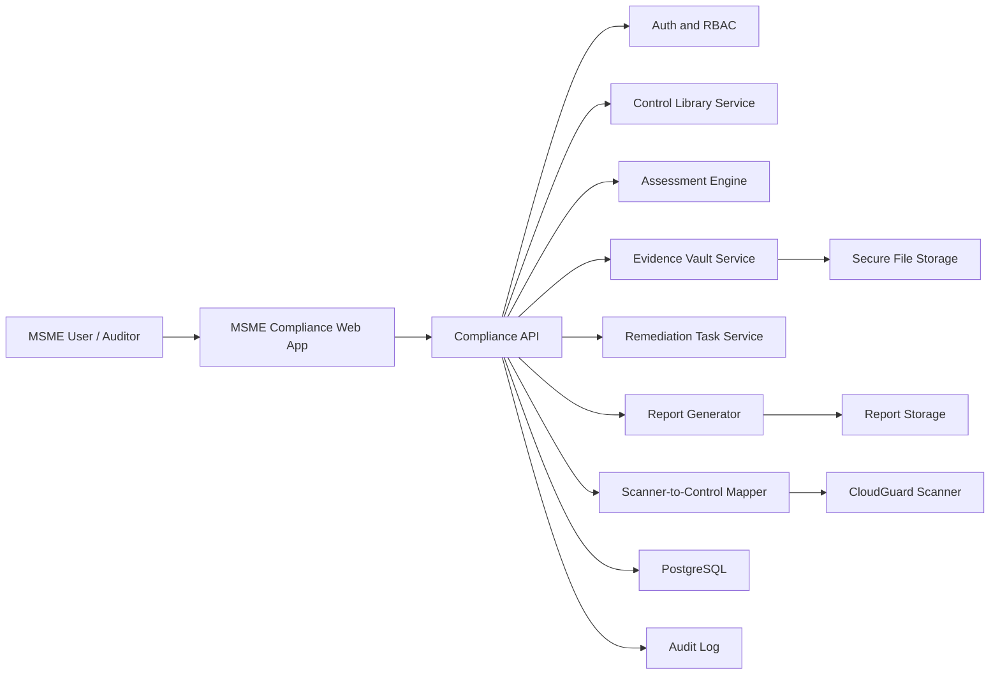

# MSME Cyber Compliance Platform Architecture

## Purpose

This document converts the current GRC direction into an MSME-focused cyber compliance platform for Indian Micro, Small, and Medium Enterprises. The platform should help an MSME understand, implement, evidence, monitor, and report compliance against CERT-In's "15 Elemental Cyber Defense Controls for Micro, Small, and Medium Enterprises (MSMEs)", Version 1.0 dated 01.09.2025.

Official source: https://cert-in.org.in/PDF/Elemental_Cyber_Defense_Controls_for_MSME.pdf

The platform should not feel like a generic enterprise GRC product. It should feel like an MSME readiness cockpit: simple language, guided implementation, clear evidence requirements, automated scanner inputs where possible, and audit-ready exports.

## Product Positioning

Working name: CloudGuard MSME Compliance

Primary users:

- MSME owner or management user who wants a compliance readiness view.
- Security in-charge or single point of contact responsible for CERT-In/regulator coordination.
- IT administrator who uploads evidence, runs scans, and closes remediation tasks.
- Auditor or consultant who reviews evidence and exports audit packs.

Core promise:

MSMEs can track all 15 CERT-In baseline controls, attach evidence, run cloud/security checks, generate remediation tasks, and export an audit-ready compliance pack.

## CERT-In MSME Control Library

The platform should ship with a locked baseline framework named `CERTIN_MSME_2025_V1`.

| No. | Code | Control |
| --- | --- | --- |
| 1 | EAM | Effective Asset Management |
| 2 | NES | Network and Email Security |
| 3 | EMS | Endpoint and Mobile Security |
| 4 | SC | Secure Configurations |
| 5 | PM | Patch Management |
| 6 | IM | Incident Management |
| 7 | LM | Logging and Monitoring |
| 8 | AT | Awareness and Training |
| 9 | TPRM | Third Party Risk Management |
| 10 | DPBP | Data Protection, Backup and Recovery |
| 11 | GC | Governance and Compliance |
| 12 | RPP | Robust Password Policy |
| 13 | ACIM | Access Control and Identity Management |
| 14 | PS | Physical Security |
| 15 | VAA | Vulnerability Audits and Assessments |

Each control should contain:

- CERT-In control code and title.
- Plain-English MSME explanation.
- Recommendation checklist items, such as `EAM.1`, `EAM.2`, `NES.1`, etc.
- Evidence requirements.
- Automation hints from CloudGuard scanner or manual evidence.
- Remediation task templates.
- Audit status and review history.

## Platform Modules

### 1. MSME Onboarding

Goal: classify the organization and initialize the correct compliance workspace.

Fields:

- Organization name, Udyam/MSME registration number, industry, location, employee count.
- MSME type: micro, small, medium.
- Security in-charge / CERT-In point of contact.
- Infrastructure profile: office network, cloud, email provider, endpoints, website/app, vendors.
- Current maturity: new, partially implemented, audit-ready.

Output:

- Workspace created.
- 15 controls initialized.
- Suggested implementation priority based on business profile.

### 2. Compliance Dashboard

Goal: give management a clear readiness view.

Widgets:

- Overall readiness score.
- 15-control status grid.
- Mandatory annual audit countdown.
- Critical open gaps.
- Evidence freshness score.
- CloudGuard scanner risk summary.
- Incident reporting readiness, including CERT-In 6-hour reporting reminder.

Status model:

- Not Started
- In Progress
- Implemented
- Evidence Uploaded
- Verified
- Exception Approved
- Not Applicable

### 3. 15-Control Workspace

Goal: make each control actionable.

Each control page should show:

- Objective.
- CERT-In recommendation checklist.
- Required evidence.
- Current implementation status.
- Linked scanner findings.
- Linked policies and documents.
- Owner and due date.
- Remediation tasks.
- Auditor comments.

Example for `RPP - Robust Password Policy`:

- Checklist: strong password length, lockout after failed attempts, MFA, secure password hashing.
- Evidence: password policy, SSO/MFA screenshots, identity provider configuration export.
- Automated checks: exposed credentials, weak IAM policies, admin accounts without MFA where scanner data exists.
- Tasks: enable MFA, rotate shared credentials, document password policy.

### 4. Evidence Vault

Goal: store and organize audit evidence.

Evidence types:

- Document: policy, procedure, checklist, report.
- Screenshot.
- Scanner result.
- Configuration export.
- Training record.
- Vendor questionnaire.
- Incident drill record.

Evidence metadata:

- Linked control and recommendation ID.
- Owner.
- Uploaded by.
- Evidence date.
- Expiry/review date.
- Hash for integrity.
- Auditor review status.

Storage requirement:

- Store evidence files securely.
- Keep audit trail of upload, delete, review, and approval events.
- Never expose secrets in evidence previews.

### 5. CloudGuard Scanner Integration

Goal: use the existing CloudGuard scanner as technical evidence and automated gap detection.

CloudGuard findings should map into MSME controls:

| Scanner Signal | MSME Controls |
| --- | --- |
| Public cloud assets and inventory gaps | EAM, NES |
| Open security groups, exposed services, insecure network paths | NES, SC |
| Missing encryption or public storage | DPBP, SC |
| IAM over-permission, shared/admin access, missing MFA indicators | ACIM, RPP |
| Unpatched packages, vulnerable infrastructure, IaC misconfigurations | PM, VAA, SC |
| Logging disabled or weak audit trail | LM, GC |
| Backup or recovery weakness | DPBP |
| Kubernetes RBAC, exposed services, insecure workloads | ACIM, NES, SC, VAA |

Scanner flow:

1. User runs AWS, GCP, Kubernetes, or IaC scan.
2. Scanner stores findings in CloudGuard.
3. Compliance mapper tags findings to MSME controls.
4. Open gaps are created or updated.
5. Remediation tasks appear on the control page.
6. Fixed findings can become evidence for audit closure.

### 6. Remediation and Task Management

Goal: turn gaps into work.

Task fields:

- Title.
- Linked control/recommendation.
- Severity.
- Owner.
- Due date.
- Status.
- Evidence required for closure.
- Scanner finding link.
- Internal notes.

Task types:

- Manual implementation task.
- Scanner-generated remediation task.
- Evidence request.
- Policy review task.
- Audit observation task.

### 7. Policy and Template Center

Goal: help MSMEs create minimum viable policies without legal-heavy complexity.

Templates:

- Information Security Policy.
- Incident Response Plan.
- Backup and Recovery Policy.
- Password and MFA Policy.
- Acceptable Use Policy.
- Vendor Security Checklist.
- Asset Disposal Checklist.
- Employee Exit Asset Return Checklist.
- Cybersecurity Awareness Attendance Template.

Each template should map to one or more controls.

### 8. Incident Readiness

Goal: help MSMEs prepare for incident reporting and drills.

Features:

- Incident response plan checklist.
- Incident drill tracker.
- CERT-In reporting workflow reminder.
- 6-hour reporting timer after incident detection.
- Incident evidence package: timeline, screenshots, affected assets, actions taken.

### 9. Vendor and Third-Party Risk

Goal: satisfy TPRM in a lightweight MSME-friendly way.

Features:

- Vendor inventory.
- Vendor criticality rating.
- Security questionnaire.
- Contract/security clause tracking.
- Evidence upload for vendor assurance.
- Annual review reminder.

### 10. Training Tracker

Goal: satisfy awareness and training controls.

Features:

- Employee/contractor training list.
- Twice-yearly training schedule.
- Attendance evidence.
- Phishing/password/social engineering module completion.
- CERT-In workshop or cyber drill participation record.

### 11. Audit Pack Generator

Goal: produce a clean audit-ready export.

Exports:

- Executive readiness summary.
- Control-by-control status report.
- Evidence index.
- Open gaps and remediation plan.
- Scanner findings mapped to controls.
- Auditor observation log.

Formats:

- PDF.
- DOCX.
- CSV evidence index.
- ZIP evidence pack.

## System Architecture

Recommended stack, aligned with the current project:

- Frontend: existing HTML/JS or future React UI.
- Backend: FastAPI services.
- Database: PostgreSQL.
- Evidence storage: object storage or secure local/Vercel-compatible blob storage.
- Scanner: existing CloudGuard scanner and scan history.
- Auth: existing SSO/dev auth path initially; add role-based permissions for admin, contributor, auditor.
- Reports: existing report generation approach can be extended for MSME audit packs.

## Database Model

Suggested tables:

- `msme_organizations`: org profile and MSME classification.
- `msme_frameworks`: framework metadata, e.g. `CERTIN_MSME_2025_V1`.
- `msme_controls`: 15 controls.
- `msme_recommendations`: 45 baseline recommendations.
- `msme_assessments`: one assessment cycle per org/year.
- `msme_control_status`: per-org control status, owner, score, due date.
- `msme_evidence`: uploaded evidence metadata.
- `msme_tasks`: remediation and evidence tasks.
- `msme_scanner_mappings`: mapping from CloudGuard findings to controls.
- `msme_vendor_reviews`: third-party risk records.
- `msme_training_records`: awareness training evidence.
- `msme_incidents`: incident readiness and incident reporting records.
- `msme_audit_exports`: generated report history.
- `msme_audit_log`: immutable action history.

## API Layout

Core endpoints:

- `GET /api/msme/framework`
- `GET /api/msme/controls`
- `GET /api/msme/controls/{control_code}`
- `PATCH /api/msme/controls/{control_code}/status`
- `POST /api/msme/evidence`
- `GET /api/msme/evidence?control=EAM`
- `POST /api/msme/tasks`
- `PATCH /api/msme/tasks/{task_id}`
- `POST /api/msme/scanner/map-latest`
- `GET /api/msme/dashboard`
- `POST /api/msme/reports/audit-pack`
- `GET /api/msme/reports/{report_id}`

## UI Navigation

Primary sidebar:

- Overview
- 15 Controls
- Evidence Vault
- Scanner Findings
- Remediation Tasks
- Policies
- Vendors
- Training
- Incidents
- Audit Pack
- Settings

## Screen Layouts

### Overview

Top cards:

- Readiness Score
- Controls Verified
- Open Critical Gaps
- Evidence Expiring
- Days to Annual Audit

Main sections:

- 15-control heatmap.
- Priority actions.
- Latest CloudGuard scan findings mapped to controls.
- Evidence health.
- Recent audit activity.

### 15 Controls

Layout:

- Left: searchable control list with status chips.
- Center: selected control details and checklist.
- Right: evidence, owner, due date, scanner gaps, auditor notes.

Control card fields:

- Control code and name.
- Status.
- Implementation score.
- Evidence count.
- Open tasks.
- Last reviewed date.

### Evidence Vault

Layout:

- Filters: control, evidence type, owner, review status, expiry.
- Evidence table.
- Upload drawer.
- Preview panel.

### Scanner Findings

Layout:

- CloudGuard scan selector.
- Finding severity summary.
- Finding-to-control mappings.
- "Create remediation task" action.
- "Mark as evidence" action after fix verification.

### Audit Pack

Layout:

- Assessment period selector.
- Include/exclude evidence types.
- Pre-export checks.
- Generate PDF/DOCX/ZIP.
- Export history.

## Scoring Model

Each recommendation can score:

- 0: Not implemented.
- 25: Planned.
- 50: Partially implemented.
- 75: Implemented with evidence pending.
- 100: Verified with evidence.

Control score:

- Average of recommendation scores.
- Deduct for expired evidence.
- Deduct for unresolved high/critical scanner findings mapped to the control.

Overall readiness:

- Weighted average of 15 control scores.
- Mandatory blockers: incident reporting readiness, MFA for critical systems, annual VAA, logging retention, asset inventory.

## Implementation Roadmap

### Phase 1: Foundation

- Add CERT-In MSME framework seed data.
- Add organization profile and assessment cycle.
- Build dashboard and 15-control pages.
- Add manual control status updates.

### Phase 2: Evidence and Tasks

- Add evidence vault.
- Add remediation tasks.
- Add policy/template center.
- Add audit trail.

### Phase 3: CloudGuard Mapping

- Map scanner findings to MSME controls.
- Add scanner findings page.
- Auto-create compliance gaps.
- Feed scan results into readiness score.

### Phase 4: Audit Pack

- Add PDF/DOCX export.
- Add evidence index.
- Add auditor review mode.
- Add annual assessment cycle reports.

### Phase 5: Advanced Automation

- Vendor questionnaires.
- Training tracker.
- Incident drill tracker.
- Notifications and reminders.
- Optional AI assistant for policy drafting and remediation guidance.

## Migration From GRC Direction

Keep:

- CloudGuard scanner.
- Auth/session logic.
- Scan history and findings.
- Report generation utilities.
- Evidence-style audit logging concepts.

Replace or rename:

- Generic "GRC" language should become "MSME Compliance".
- Framework mapping should default to `CERTIN_MSME_2025_V1`.
- Generic risks should become MSME control gaps.
- Trust-center style enterprise features should be secondary or removed.

Do not build first:

- Heavy enterprise policy workflows.
- Complex multi-framework GRC.
- SOC2/ISO mapping unless later requested.
- Marketplace-style integrations unless needed for evidence collection.

## Immediate UI Copy Changes

Suggested language:

- "GRC Dashboard" -> "MSME Compliance Dashboard"
- "Frameworks" -> "CERT-In MSME Controls"
- "Risks" -> "Compliance Gaps"
- "Evidence" -> "Audit Evidence"
- "Reports" -> "Audit Pack"
- "Controls" -> "15 Controls"

## Success Criteria

The platform is ready for the first demo when:

- All 15 CERT-In MSME controls are visible.
- Each control has checklist items and evidence requirements.
- User can update implementation status.
- User can upload evidence.
- CloudGuard findings can be mapped to at least 6 technical controls.
- Dashboard shows readiness score and open gaps.
- Audit pack export produces a formal report with evidence index.

