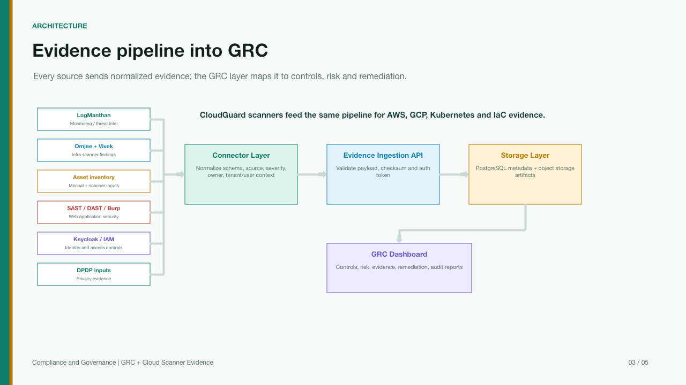
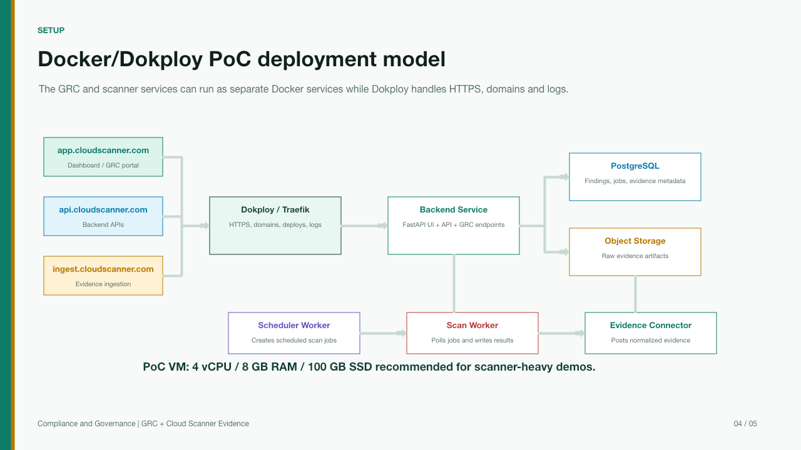

<!-- _class: lead -->

# CloudGuard

## Cloud security, evidence ingestion, and GRC dashboard

Project deck maintained in GitHub with Marp, exported to HTML, PDF, and PPTX.

---

# Project Objective

Build a containerized security platform that collects scanner output and turns it into compliance-ready evidence.

- Scan AWS, GCP, Kubernetes, and Infrastructure-as-Code targets
- Keep scanner workloads decoupled from the portal
- Normalize findings through evidence connectors
- Store evidence artifacts with checksum, source, control mapping, and metadata
- Show leadership and audit teams one GRC-oriented view

---

# What The Platform Includes

| Area | Current project capability |
|---|---|
| Cloud security | AWS, GCP, CloudFox-assisted cloud posture and attack-path scanning |
| Kubernetes | Kubeconfig-based live scan, manifest scan, RBAC, services, namespaces, network policies |
| IaC | Uploaded or repository files for Terraform and CloudFormation |
| App security | OWASP ZAP, Nuclei, Gitleaks, Trivy, Safety integration paths |
| GRC | Compliance dashboard, control evidence, source summary, audit artifacts |
| AI | Optional OpenAI-compatible endpoint for analysis and recommendations |

---

# Evidence Architecture



---

# Decoupled Scan Job Flow

```text
Dashboard / API
        |
        v
POST /api/jobs/scan
        |
        v
PostgreSQL scan_jobs queue
        |
        v
scan-worker on VM
        |
        v
scan results + evidence artifacts
        |
        v
Compliance dashboard + reports
```

The portal queues and displays work. Scanner workers process jobs separately so heavy scans do not block the UI.

---

# Evidence Connector Contract

External tools do not need to be inside the dashboard. They can send normalized evidence to one API.

```http
POST /api/evidence
x-connector-token: <CONNECTOR_TOKEN>
x-cloudguard-user: <user-or-tenant>
```

```json
{
  "control_id": "A.1.3.7",
  "source_system": "trivy",
  "scanner_type": "container",
  "artifact_type": "json",
  "payload": { "findings": [] },
  "metadata": { "connector": "trivy-file" }
}
```

---

# Data Stored For Evidence

| Table | Purpose |
|---|---|
| `scan_jobs` | Job ID, user, providers, status, attempts, worker ID, result, error, timestamps |
| `evidence_artifacts` | Evidence ID, job ID, user, control ID, source system, scanner type, storage URI, checksum, payload |

Operational status supports:

- `queued`, `running`, `completed`, `failed`, `dead_letter`, `cancelled`
- retry/cancel APIs for operations
- latest evidence and control-level evidence lookup

---

# Kubernetes Scanner Coverage

The Kubernetes scanner now supports both live cluster scanning and manifest scanning.

| Mode | What it checks |
|---|---|
| Live kubeconfig | Pods, services, secrets, namespaces, deployments, jobs, cronjobs |
| RBAC | RoleBindings and ClusterRoleBindings with risky permissions |
| Network | LoadBalancer/NodePort exposure and missing NetworkPolicies |
| Managed clusters | EKS, GKE, AKS metadata enrichment when cloud credentials exist |
| Drift | Compare live resources with Kubernetes IaC manifests |

---

# IaC Scanner Coverage

The IaC scanner accepts full files, so users can upload repository snippets or complete templates.

| IaC type | Detection examples |
|---|---|
| Terraform | Public S3 ACL, missing public access block, unrestricted security groups |
| Terraform | Public databases, missing RDS encryption, public IPs, wildcard IAM |
| CloudFormation | Public buckets, missing encryption, public ingress, broad IAM |
| Uploaded files | `.tf`, `.tfvars`, `.hcl`, `.yaml`, `.yml`, `.json` |

Uploaded scans also persist evidence with `control_id = iac.uploaded_files`.

---

# Deployment PoC



---

# Recommended Deployment Shape

| Layer | Recommended placement |
|---|---|
| Portal and GRC | VM/Dokploy or DigitalOcean app layer |
| PostgreSQL | Managed DB or private VM database for PoC |
| Object storage | MinIO for PoC, S3-compatible storage for production |
| Scanner workers | Separate VM on E2E or other economical provider |
| Evidence connectors | Separate service/VM posting into `/api/evidence` |

Recommended PoC VM for Docker-heavy single-node validation: **4 vCPU, 8 GB RAM, 100 GB SSD**.

---

# Multi-Tenant Direction

The current implementation separates data primarily by `user_id`.

For production multi-tenant architecture, scanners and connectors should send:

- `tenant_id` for organization-level segregation
- `user_id` for operator/auditor attribution
- `source_system`, `scanner_type`, `control_id`, and `job_id` for traceability
- tenant-scoped credentials, jobs, findings, evidence, reports, and audit events

This lets every scanner follow the same evidence contract without coupling to the portal internals.

---

# What This PoC Proves

- CloudGuard can run as a Docker Compose stack through Dokploy
- Dashboard, API, workers, database, and evidence storage can run together for PoC
- Scanner jobs are separated from the portal through `scan_jobs`
- Evidence connectors can ingest external scanner output
- GRC dashboard can map technical evidence to control status
- The platform can be hosted away from AWS while still scanning AWS accounts

---

# GitHub + Marp Workflow

```text
Edit this Markdown deck
        |
        v
Commit / PR on GitHub
        |
        v
GitHub Action builds HTML + PDF + PPTX
        |
        v
GitHub Pages shares latest project/workshop deck
```

Same source file, multiple outputs, easy review history.

---

<!-- _class: closing -->

# Recommendation

Use this Marp setup for the workshop and project updates.

Keep PPTX/PDF exports for formal sharing, and publish the HTML deck through GitHub Pages for live updates.
